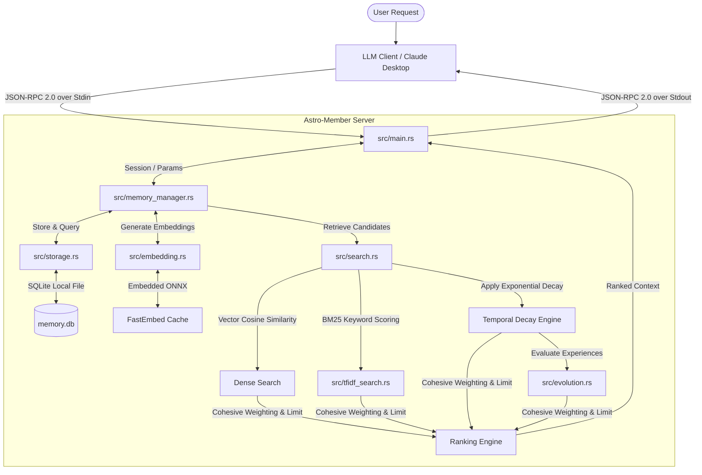

# Astro-Member: Hierarchical Memory MCP Server

[](https://www.rust-lang.org/)
[](https://modelcontextprotocol.io/)
[](#license)

`astro-member` is a lightweight, high-performance **Model Context Protocol (MCP) Server** written in Rust. It serves as an external memory system for LLM agents, featuring **hierarchical memory layers**, **graph semantic associations**, **temporal exponential decay**, **experience reinforcement**, and **hybrid vector/keyword search**.

Instead of relying on heavy vector database servers, `astro-member` utilizes a localized SQLite database alongside an embedded embedding model (`fastembed`) to achieve self-contained, low-latency semantic indexing and relationship storage.

---

## 🗺️ System Architecture / 系统架构

The server handles incoming JSON-RPC 2.0 requests over standard I/O (stdin/stdout) and coordinates embedding extraction, SQLite storage, decay calculations, and hybrid similarity ranking.
服务器通过标准输入输出（stdin/stdout）处理 JSON-RPC 2.0 请求，并协调向量提取、SQLite 存储、衰减计算以及混合相似度排序。



---

## ✨ Core Features / 核心功能

### 1. Hierarchical Memory Layers / 多层级记忆体系
Memory is organized into four logical layers, each with distinct retention characteristics, base weights, and decay rules:
内存划分为四个逻辑层级，每一层级都具备独特的留存策略、基础权重和衰减模型：

*   **Rule Layer / 规则层 (highest priority, base weight: `2.0` / 最高优先级，基础权重 `2.0`)**: 
    Permanent instructions and core guidelines. Completely exempt from relevance filtering and temporal decay. / 存放永久性操作指令与核心准则。免受相似度阈值过滤及时间衰减的影响。
*   **Persona Layer / 人设层 (medium-high priority, base weight: `1.5` / 中高优先级，基础权重 `1.5`)**: 
    Captures user/agent tone, preference, and style. Decays extremely slowly ($e^{-0.001t}$). / 捕捉用户或智能体的语气偏好与性格特征。以极低的速度（$e^{-0.001t}$）缓慢衰减。
*   **Experience Layer / 经验层 (medium priority, base weight: `1.0` / 中等优先级，基础权重 `1.0`)**: 
    Stores problem-solving strategies, designs, and historical scenarios. Score can be dynamically reinforced (multiplied by `1.1` on success, `0.8` on failure, clamped between `0.1` and `5.0`). / 储存问题解决方案、系统设计和历史上下文。其评估分数通过强化学习动态调整（成功时乘 `1.1`，失败时乘 `0.8`，限制在 `0.1` 至 `5.0` 之间）。
*   **Session Layer / 会话层 (standard priority, base weight: `1.0` / 标准优先级，基础权重 `1.0`)**: 
    Short-term contextual memory isolated by `session_id`. Decays rapidly ($e^{-0.2t}$) to mimic human forgetting. / 依照 `session_id` 进行逻辑隔离的短期会话上下文。衰减速度极快（$e^{-0.2t}$），类似于人类的遗忘规律。

### 2. File-Based Graph Semantic Associations / 语义关联关系图
Connects discrete memories with directed, typed semantic relations (e.g. `depends_on`, `related_to`, `contradicts`).
使用有向且带类型的语义关联关系（例如 `depends_on`、`related_to`、`contradicts`）将离散的记忆片段有机连接起来。
*   Strict validation prevents self-referential relations or connections to non-existent nodes. / 严密的完整性校验，杜绝产生指向自身的环或连接到不存在的记忆节点。
*   Supports querying incoming, outgoing, or bidirectional associations. / 支持遍历入边（Incoming）、出边（Outgoing）或双向关联关系。
*   **Cascading Deletion / 级联删除**: Deleting a memory automatically purges all connected associations in the database to maintain referential integrity. / 删除某条记忆时，数据库会自动级联清除与其关联的所有关系边，以保证数据的完整性。

### 3. Dual-Track Hybrid Search Engine / 双轨混合搜索引擎
*   **Dense Search / 向量搜索**: Embedded `fastembed` (BGEM3) extracts vector representations. Retrieves matches using Cosine Similarity with automatic clamping against NaN or zero-norm anomalies. / 采用嵌入式 `fastembed` (BGEM3) 模型提取语义向量，通过余弦相似度计算匹配度，并内置 NaN 或零模向量保护机制。
*   **Sparse Search / 关键词搜索**: Custom in-memory BM25-based TF-IDF algorithm tracks word frequencies to guarantee high-scoring exact keyword matching. / 自研轻量级内存级 BM25 词频统计算法，确保高精准度的关键词硬匹配。
*   **Bypass Exemption / 过滤豁免**: Rule/Persona layers bypass the minimum relevance score gate (`0.65`), ensuring critical rules are always active in context. / 规则层和人设层记忆在检索时免受最低相似度阈值（`0.65`）的拦截，保证智能体的核心限制准则绝对不丢失。

---

## 🛠️ MCP Tool Interface API / MCP 工具接口手册

The server exposes the following 6 core JSON-RPC tools to the Model Context Protocol (MCP) clients. Below is the detailed parameter behavior, constraints, and JSON-RPC payloads.
本服务器向 MCP 客户端公开了 6 个核心 JSON-RPC 工具。以下为详细的参数行为、约束说明以及 JSON-RPC 载荷示例。

### 1. `store_memory`
Stores a memory conceptually into different hierarchical layers. / 将记忆概念化存储到指定的内存层级。

#### Parameters / 参数列表
| Parameter / 参数 | Type / 类型 | Required? / 是否必填 | Constraints & Default / 约束与默认值 | Description & Effect / 描述与作用 |
| :--- | :--- | :--- | :--- | :--- |
| `layer` | String | **Yes / 是** | Enum: `["Rule", "Persona", "Experience", "Session"]` (Also supports legacy `"Principle"` as alias for `"Rule"`) | **Layer Selection**: Determines the retention, base weight, and decay speed. / **层级选择**：决定记忆的留存期、基础权重和衰减速度。 |
| `content` | String | **Yes / 是** | Non-empty string / 非空字符串 | **Memory Content**: The text of the memory to store. / **记忆内容**：要保存的文本信息。 |
| `session_id` | String | **Conditional / 条件必填** | Required if `layer` is `"Session"`; Must be `null` or omitted otherwise. / 如果 `layer` 为 `"Session"`，则必填；否则必须为空或省略。 | **Session Isolation**: Separates short-term session memories to avoid cross-talk. / **会话隔离**：隔离各会话下的短期记忆，防止跨会话上下文污染。 |
| `context_tags` | Array of Strings | No / 否 | Default: `[]` | **Metadata Tags**: Custom tags associated with the memory for filtering. / **元数据标签**：与记忆相关联的分类标签，便于后续按标签检索或过滤。 |

#### Optional Parameter Behavior / 可选与条件参数行为
- **`session_id`**: 
  - **Required for Session Layer**: If `layer` is `"Session"`, a non-empty `session_id` must be provided. Failing to do so returns a validation error.
  - **Forbidden for Other Layers**: If `layer` is `"Rule"`, `"Persona"`, or `"Experience"`, providing `session_id` will trigger an error. This keeps global layers clean and untainted by individual session IDs.
- **`context_tags`**: 
  - Allows tagging memories (e.g. `["code", "rust", "config"]`). If not supplied, it defaults to an empty array.

#### JSON-RPC 2.0 Example / JSON-RPC 2.0 示例
**Request (Session Layer) / 请求（会话层）**:
```json
{
  "jsonrpc": "2.0",
  "method": "tools/call",
  "params": {
    "name": "store_memory",
    "arguments": {
      "layer": "Session",
      "session_id": "session-1234",
      "content": "User prefers compile commands in PowerShell instead of cmd.",
      "context_tags": ["user_preference", "windows"]
    }
  },
  "id": 1
}
```
**Response / 响应**:
```json
{
  "jsonrpc": "2.0",
  "result": {
    "content": [
      {
        "type": "text",
        "text": "{\"status\":\"success\",\"memory_id\":\"4fa93c6f-a89e-4e89-a20d-85f26588db64\"}"
      }
    ]
  },
  "id": 1
}
```

---

### 2. `retrieve_memory`
Retrieves memories across layers using cohesive weighted search. / 通过多层级加权混合搜索检索相关记忆。

#### Parameters / 参数列表
| Parameter / 参数 | Type / 类型 | Required? / 是否必填 | Constraints & Default / 约束与默认值 | Description & Effect / 描述与作用 |
| :--- | :--- | :--- | :--- | :--- |
| `query` | String | **Yes / 是** | Non-empty string / 非空字符串 | **Search Query**: The query used for hybrid dense vector + sparse keyword matching. / **查询词**：用于双轨混合搜索（Dense 向量 + Sparse 关键词）的检索词。 |
| `session_id` | String | No / 否 | Default: `null` | **Active Session Context**: If supplied, search results will include Session layer memories matching this ID. / **活跃会话上下文**：若提供，检索结果中将包含归属于该 ID 的会话层记忆；若不提供，检索时将完全排除会话层记忆。 |

#### Optional Parameter Behavior / 可选参数行为
- **`session_id`**:
  - **If supplied / 传入时**: The search engine retrieves global memories (Rule, Persona, Experience) as well as the active session's memories (`session_id = ?`).
  - **If omitted / 未传入时**: The engine completely ignores the Session layer. Only Rule, Persona, and Experience layers are evaluated. This prevents leakage of short-term memories from other parallel sessions.
- **Similarity Threshold / 相似度过滤门槛**:
  - The system enforces a strict semantic similarity floor of **`0.65`** to filter out irrelevant background noise.
  - **Exemption**: Memories in the `Rule` (Rule) and `Persona` (Persona) layers are exempt from this threshold, ensuring crucial instructions and agent parameters are always recalled even with lower query matches.

#### JSON-RPC 2.0 Example / JSON-RPC 2.0 示例
**Request / 请求**:
```json
{
  "jsonrpc": "2.0",
  "method": "tools/call",
  "params": {
    "name": "retrieve_memory",
    "arguments": {
      "query": "PowerShell compile instructions",
      "session_id": "session-1234"
    }
  },
  "id": 2
}
```
**Response / 响应**:
```json
{
  "jsonrpc": "2.0",
  "result": {
    "content": [
      {
        "type": "text",
        "text": "{\"results\":[{\"memory\":{\"id\":\"4fa93c6f-a89e-4e89-a20d-85f26588db64\",\"layer\":\"Session\",\"session_id\":\"session-1234\",\"content\":\"User prefers compile commands in PowerShell instead of cmd.\",\"tags\":[\"user_preference\",\"windows\"],\"created_at\":\"2026-06-06T06:26:00Z\",\"last_accessed\":\"2026-06-06T06:27:00Z\",\"access_count\":1,\"evaluation_score\":1.0},\"score\":1.85}]}"
      }
    ]
  },
  "id": 2
}
```

---

### 3. `get_memory_by_id`
Retrieves a specific memory by its unique ID. / 通过唯一 ID 获取特定记忆条目。

#### Parameters / 参数列表
| Parameter / 参数 | Type / 类型 | Required? / 是否必填 | Constraints & Default / 约束与默认值 | Description & Effect / 描述与作用 |
| :--- | :--- | :--- | :--- | :--- |
| `id` | String | **Yes / 是** | UUID string / UUID 格式字符串 | **Target Memory ID**: The UUID of the memory item to fetch. / **目标记忆ID**：待获取记忆的 UUID。 |
| `session_id` | String | **Conditional / 条件必填** | Required if the target memory is in the Session layer; Ignored or optional otherwise. / 若目标记忆属于会话层（Session），则必须提供匹配的会话ID；否则可以省略。 | **Security Session Isolation**: Prevents unauthorized access or leakage of session memory. / **安全会话隔离**：防止未授权的跨会话记忆获取与泄露。 |

#### Optional Parameter Behavior / 可选与条件参数行为
- **`session_id`**:
  - If the target memory belongs to the `"Session"` layer, the supplied `session_id` **must match** the memory's stored `session_id`. If they do not match or if `session_id` is missing, the request returns a NotFound error.
  - This ensures that even if an agent guesses or obtains a UUID, it cannot access session data belonging to another session.

#### JSON-RPC 2.0 Example / JSON-RPC 2.0 示例
**Request / 请求**:
```json
{
  "jsonrpc": "2.0",
  "method": "tools/call",
  "params": {
    "name": "get_memory_by_id",
    "arguments": {
      "id": "4fa93c6f-a89e-4e89-a20d-85f26588db64",
      "session_id": "session-1234"
    }
  },
  "id": 3
}
```
**Response / 响应**:
```json
{
  "jsonrpc": "2.0",
  "result": {
    "content": [
      {
        "type": "text",
        "text": "{\"status\":\"success\",\"memory\":{\"id\":\"4fa93c6f-a89e-4e89-a20d-85f26588db64\",\"layer\":\"Session\",\"session_id\":\"session-1234\",\"content\":\"User prefers compile commands in PowerShell instead of cmd.\",\"tags\":[\"user_preference\",\"windows\"],\"created_at\":\"2026-06-06T06:26:00Z\",\"last_accessed\":\"2026-06-06T06:27:00Z\",\"access_count\":2,\"evaluation_score\":1.0}}"
      }
    ]
  },
  "id": 3
}
```

---

### 4. `evaluate_experience`
Performs reinforcement learning by providing feedback on an Experience memory. / 对经验层记忆提供成功或失败反馈，以此进行强化学习。

#### Parameters / 参数列表
| Parameter / 参数 | Type / 类型 | Required? / 是否必填 | Constraints & Default / 约束与默认值 | Description & Effect / 描述与作用 |
| :--- | :--- | :--- | :--- | :--- |
| `memory_id` | String | **Yes / 是** | UUID string of an Experience memory / 经验层记忆的 UUID | **Target Experience ID**: The UUID of the Experience layer memory. / **目标经验ID**：要进行评估反馈的经验层记忆 UUID。 |
| `success` | Boolean | **Yes / 是** | `true` or `false` / 布尔值 | **Feedback Outcome**: If `true`, the memory score is boosted. If `false`, the score is penalized. / **反馈结果**：若为 `true` 则提升该记忆权重；若为 `false` 则降低其权重。 |

#### Behavior & Limitations / 行为与限制
- **Score Modification (权重调整)**:
  - **Success (`true`)**: The current `evaluation_score` is multiplied by **`1.1`** (capped at `5.0`).
  - **Failure (`false`)**: The current `evaluation_score` is multiplied by **`0.8`** (clamped to a minimum of `0.1`).
- **Validation Constraints (层级限制)**:
  - This tool is **only** applicable to memories in the `"Experience"` layer. If called on a memory in the Rule, Persona, or Session layer, it will return an error indicating the memory layer is invalid for evaluation.

#### JSON-RPC 2.0 Example / JSON-RPC 2.0 示例
**Request / 请求**:
```json
{
  "jsonrpc": "2.0",
  "method": "tools/call",
  "params": {
    "name": "evaluate_experience",
    "arguments": {
      "memory_id": "7ca83c6f-a89e-4e89-a20d-85f26588db99",
      "success": true
    }
  },
  "id": 4
}
```
**Response / 响应**:
```json
{
  "jsonrpc": "2.0",
  "result": {
    "content": [
      {
        "type": "text",
        "text": "{\"status\":\"evaluated\"}"
      }
    ]
  },
  "id": 4
}
```

---

### 5. `create_association`
Draws a directed graph association between two memories. / 在两条记忆之间建立有向图语义关联关系。

#### Parameters / 参数列表
| Parameter / 参数 | Type / 类型 | Required? / 是否必填 | Constraints & Default / 约束与默认值 | Description & Effect / 描述与作用 |
| :--- | :--- | :--- | :--- | :--- |
| `source_id` | String | **Yes / 是** | UUID string / UUID 格式字符串 | **Source Memory ID**: The UUID of the source node in the relation. / **源记忆ID**：关联关系起点的 UUID。 |
| `target_id` | String | **Yes / 是** | UUID string / UUID 格式字符串 | **Target Memory ID**: The UUID of the target node in the relation. / **目标记忆ID**：关联关系终点的 UUID。 |
| `relation_type` | String | **Yes / 是** | Custom string (e.g. `"depends_on"`, `"related_to"`) / 自定义关系词 | **Relationship Type**: The semantic label describing how source relates to target. / **关联关系类型**：描述起点到终点之间语义关系的自定义标签。 |

#### Behavior & Integrity / 机制与完整性约束
- **Self-Relation Prevention (防止自环)**: `source_id` and `target_id` cannot be the same. The server will reject self-referential relations.
- **Existential Validation (存在性校验)**: Both memory IDs must exist in the database; otherwise, a foreign key or existential error is thrown.
- **Cascading Deletion (级联删除)**: If a memory is deleted, all associations involving it (as source or target) are automatically purged to prevent orphaned graph edges.

#### JSON-RPC 2.0 Example / JSON-RPC 2.0 示例
**Request / 请求**:
```json
{
  "jsonrpc": "2.0",
  "method": "tools/call",
  "params": {
    "name": "create_association",
    "arguments": {
      "source_id": "4fa93c6f-a89e-4e89-a20d-85f26588db64",
      "target_id": "7ca83c6f-a89e-4e89-a20d-85f26588db99",
      "relation_type": "depends_on"
    }
  },
  "id": 5
}
```
**Response / 响应**:
```json
{
  "jsonrpc": "2.0",
  "result": {
    "content": [
      {
        "type": "text",
        "text": "{\"status\":\"association_created\"}"
      }
    ]
  },
  "id": 5
}
```

---

### 6. `get_associations`
Queries relations connected to a source memory. / 查询与目标源记忆相连的所有语义关联关系。

#### Parameters / 参数列表
| Parameter / 参数 | Type / 类型 | Required? / 是否必填 | Constraints & Default / 约束与默认值 | Description & Effect / 描述与作用 |
| :--- | :--- | :--- | :--- | :--- |
| `source_id` | String | **Yes / 是** | UUID string / UUID 格式字符串 | **Query Center ID**: The UUID of the memory node to query relationships for. / **查询中心ID**：待查询关系的记忆 UUID。 |
| `direction` | String | No / 否 | Enum: `["outgoing", "incoming", "both"]` (Default: `"outgoing"`) | **Query Direction**: Direction of edges to traverse relative to the source memory. / **关系遍历方向**：指定关系遍历的方向。默认仅遍历出边。 |

#### Optional Parameter Behavior / 可选参数行为
- **`direction`**:
  - **`"outgoing"` (Default / 默认)**: Returns associations where the memory is the `source_id`. Shows what other memories this memory references or depends on. / 返回以当前记忆为起点的关联，展现当前记忆依赖或引用的其它记忆。
  - **`"incoming"`**: Returns associations where the memory is the `target_id`. Shows what other memories reference or depend on this memory. / 返回以当前记忆为终点的关联，展现有哪些其它记忆依赖或引用了它。
  - **`"both"`**: Returns both incoming and outgoing associations. / 返回以上两者，展示该记忆在关联图中的完整连接情况。

#### JSON-RPC 2.0 Example / JSON-RPC 2.0 示例
**Request / 请求**:
```json
{
  "jsonrpc": "2.0",
  "method": "tools/call",
  "params": {
    "name": "get_associations",
    "arguments": {
      "source_id": "4fa93c6f-a89e-4e89-a20d-85f26588db64",
      "direction": "both"
    }
  },
  "id": 6
}
```
**Response / 响应**:
```json
{
  "jsonrpc": "2.0",
  "result": {
    "content": [
      {
        "type": "text",
        "text": "{\"associations\":[{\"source_id\":\"4fa93c6f-a89e-4e89-a20d-85f26588db64\",\"target_id\":\"7ca83c6f-a89e-4e89-a20d-85f26588db99\",\"relation_type\":\"depends_on\"}]}"
      }
    ]
  },
  "id": 6
}
```

---

## ⚙️ Environment Variables & Config / 环境变量与存储配置

`astro-member` can be customized using environment variables:
`astro-member` 支持通过以下环境变量及本地目录进行定制化配置：

### 1. `FASTEMBED_CACHE_PATH`
Configures where FastEmbed downloads and caches the embedding models (ONNX files).
配置 FastEmbed 下载和缓存 Embedding 嵌入模型（ONNX文件等）的物理路径。
- **Not Set (Default) / 未配置（默认）**: The model cache is saved in a subfolder named `models_cache` located directly inside the active database storage directory. By default, it will be at `.mcp_memory_storage/models_cache`. / 模型缓存会保存在本地存储库父目录下的 `models_cache` 文件夹中（默认路径为 `.mcp_memory_storage/models_cache`）。
- **Set to a Custom Path / 设置为特定路径**: E.g., `FASTEMBED_CACHE_PATH=D:\cache\fastembed` (on Windows) or `/opt/fastembed` (on Linux). The server will download and read ONNX weights from this directory. / 例如配置为 `D:\cache\fastembed`，服务器将在指定目录下保存和加载模型权重。
- **Set to `"None"` / 设置为 `"None"` 字符串**: The server bypasses the local folder override and falls back to FastEmbed's default global folder (e.g. `%USERPROFILE%\AppData\Local` on Windows, or `~/.local/share` on Linux). / 服务器会忽略本地重写，回退到 FastEmbed 默认的系统全局缓存路径。

### 2. Local Storage Directory / 本地存储目录
By default, the server writes files to the `.mcp_memory_storage/` folder under its current working directory (CWD).
- `memory.db`: SQLite database file containing structured memory tables, metadata, evaluation scores, context tags, and semantic graph relationships.
- `models_cache/` (Default): Embedding model files cache (if `FASTEMBED_CACHE_PATH` is not custom-set).

默认情况下，服务器会在启动时的当前工作目录下（CWD）创建 `.mcp_memory_storage/` 文件夹存放以下内容：
- `memory.db`：保存结构化记忆表、元数据、强化分数、分类标签以及语义图关系的有状态 SQLite 数据库文件。
- `models_cache/`（默认）：嵌入模型的权重文件缓存目录。

---

## 🚀 Getting Started / 快速上手

### Prerequisites / 准备工作

*   **Rust**: Stable toolchain (Edition 2021) / 稳定版 Rust 工具链
*   **Python 3.8+**: Optional, for running E2E test suite / 可选，用于运行端到端测试套件

### Compilation / 编译运行

Build the release binary using the standard compiler:
对于 Windows 环境下的编译，**请务必使用 Developer Command Prompt for VS 2022** 进行编译，以确保必要的 MSVC 工具链和 SDK 被正确加载：

```bash
cargo build --release
```
The compiled executable will be located at `target/release/astro-member.exe` (on Windows) or `target/release/astro-member` (on macOS/Linux).

### Integration with Claude Desktop / 集成到 Claude 客户端

Add `astro-member` as an MCP server by modifying your `claude_desktop_config.json` configuration file:
通过修改您的 `claude_desktop_config.json` 配置文件，将 `astro-member` 添加为 MCP 服务器：

*   **Windows (PowerShell)**: `%APPDATA%\Claude\claude_desktop_config.json`
*   **macOS**: `~/Library/Application Support/Claude/claude_desktop_config.json`

Add the following config (adjust the executable path to point to your target directory):
添加以下配置（请将可执行文件路径调整为您本地的绝对路径）：

```json
{
  "mcpServers": {
    "astro-member": {
      "command": "d:\\Project\\AiProject\\astro-member\\target\\release\\astro-member.exe",
      "args": []
    }
  }
}
```

Restart Claude Desktop, and you will see the `astro-member` tool icon appear in the chat input area.
重新启动 Claude Desktop 客户端，您将在输入框区域看到 `astro-member` 工具图标已经生效。

---

## 🧪 Testing & Verification / 测试与验证

We maintain a high standard of coverage consisting of unit tests and a comprehensive Python-based E2E test suite.
我们维持了高标准的测试覆盖，包括单元测试和完整的 Python 端到端集成测试。

### Running Unit Tests / 运行单元测试
Executes database transaction, model mapping, and in-memory TF-IDF tests:
运行数据库事务、模型映射和内存中 TF-IDF 相关单元测试：
```bash
cargo test
```

### Running E2E Test Suite / 运行端到端测试
The E2E test suite (`test_e2e.py`) launches the compiled binary in an isolated temp folder, sends JSON-RPC 2.0 payloads via stdin, reads stdout, and verifies behaviour against Tiers 1-4.
端到端测试套件（`test_e2e.py`）会在隔离的临时目录中启动编译好的二进制程序，通过标准输入发送 JSON-RPC 2.0 载荷并读取标准输出，验证全部 90+ 项场景行为。

1.  Compile the debug binary:
    ```bash
    cargo build
    ```
2.  Install `pytest`:
    ```bash
    pip install pytest
    ```
3.  Run the tests:
    ```bash
    pytest test_e2e.py -v
    ```

---

## 📄 License / 开源协议

This project is licensed under the MIT License - see the [LICENSE](LICENSE) file for details.
本项目遵循 MIT 开源许可协议，详情请参阅 [LICENSE](LICENSE) 文件。
