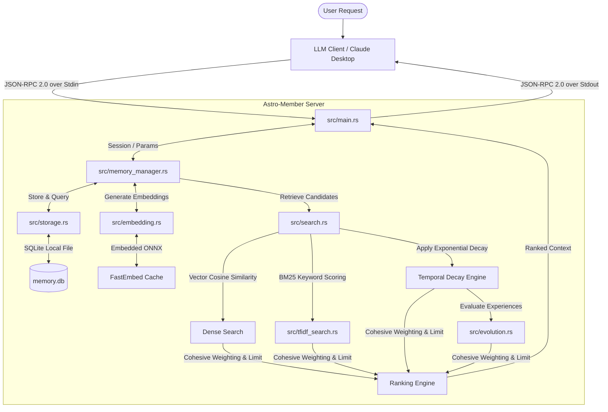

# Astro-Member: Technical Reference & Tool API Specification

This document provides deep technical details regarding the architecture, memory layers, search engine, tool interfaces, and configuration of `astro-member`.

---

## 🗺️ System Architecture

`astro-member` operates as a Model Context Protocol (MCP) server communicating over standard input/output (stdin/stdout) via JSON-RPC 2.0.



---

## 🧠 Hierarchical Memory Model

Memory in `astro-member` is conceptually split into four hierarchical layers with different retrieval and decay rules:

### 1. Rule Layer (Base Weight: `2.0`)
- **Purpose**: Permanent agent directives, system prompt guidelines, and strict operational constraints.
- **Decay**: Exempt from temporal decay (decay multiplier is always `1.0`).
- **Filtering**: Exempt from the `0.65` minimum semantic similarity retrieval threshold, ensuring that rules are always retrieved if they match even slightly.

### 2. Persona Layer (Base Weight: `1.5`)
- **Purpose**: Defines the identity, preferred tone, target persona, and style parameters of the agent or user.
- **Decay**: Decays extremely slowly ($e^{-0.001t}$) to prevent style drift while allowing minor updates over very long timelines.
- **Filtering**: Exempt from the `0.65` minimum semantic similarity threshold.

### 3. Experience Layer (Base Weight: `1.0`)
- **Purpose**: Stores historical scenarios, coding design patterns, problem-solving paths, and diagnostic outcomes.
- **Dynamic Reinforcement**:
  - Each experience entry has an `evaluation_score` (defaulting to `1.0`).
  - Upon calling `evaluate_experience` with `success=true`, the score is multiplied by `1.1` (clamped to a max of `5.0`).
  - Upon calling `evaluate_experience` with `success=false`, the score is multiplied by `0.8` (clamped to a min of `0.1`).
  - The final query score is: $\text{Base Weight} \times \text{Similarity Score} \times \text{Evaluation Score}$.

### 4. Session Layer (Base Weight: `1.0`)
- **Purpose**: Stores short-term interactive context of the current active session.
- **Isolation**: Strictly isolated by `session_id`. Queries without a matching `session_id` cannot see or modify these items.
- **Decay**: Decays rapidly ($e^{-0.2t}$) to mimic human short-term forgetting, preventing context window bloat.

---

## 🛠️ MCP Tool Interface Specification

The server exposes 6 JSON-RPC tools. Below are the parameter tables, optional behaviors, and JSON-RPC payloads.

### 1. `store_memory`
Stores a memory conceptually into a specific hierarchical layer.

#### Parameter Details
| Parameter | Type | Required? | Constraints & Defaults | Description & Effect |
| :--- | :--- | :--- | :--- | :--- |
| `layer` | String | **Yes** | Enum: `["Rule", "Persona", "Experience", "Session"]` (supports `"Principle"` as alias for `"Rule"`) | Target layer where the memory will be stored. |
| `content` | String | **Yes** | Non-empty string | The actual textual content of the memory. |
| `session_id` | String | **Conditional** | Required if `layer` is `"Session"`; must be omitted or `null` otherwise. | The session ID for short-term memory isolation. |
| `context_tags` | Array of Strings | No | Defaults to `[]` | Categorical metadata tags for manual organization. |

#### Optional & Conditional Parameter Behavior
- **`session_id`**:
  - If `layer` is `"Session"`, this parameter **must be provided** and must be a non-empty string. If omitted, the server returns an error.
  - If `layer` is NOT `"Session"`, this parameter **must be omitted** or set to `null`. If a session ID is supplied for a global layer (like Rule), the server rejects the write.
- **`context_tags`**:
  - Tags are optional and stored in the database alongside the entry. Useful for developer-side custom logic.

#### JSON-RPC 2.0 Example
**Request (Session Layer)**:
```json
{
  "jsonrpc": "2.0",
  "method": "tools/call",
  "params": {
    "name": "store_memory",
    "arguments": {
      "layer": "Session",
      "session_id": "session-xyz",
      "content": "User wants to compile with VS 2022 Dev Command Prompt.",
      "context_tags": ["compilation", "windows"]
    }
  },
  "id": 1
}
```
**Response**:
```json
{
  "jsonrpc": "2.0",
  "result": {
    "content": [
      {
        "type": "text",
        "text": "{\"status\":\"success\",\"memory_id\":\"fa189c6f-a89e-4e89-a20d-85f26588db22\"}"
      }
    ]
  },
  "id": 1
}
```

---

### 2. `retrieve_memory`
Performs a hybrid weighted semantic search across layers, applying temporal decay, reinforcement modifiers, and session isolation.

#### Parameter Details
| Parameter | Type | Required? | Constraints & Defaults | Description & Effect |
| :--- | :--- | :--- | :--- | :--- |
| `query` | String | **Yes** | Non-empty string | Search query for dual-track Dense (semantic) + Sparse (BM25 keyword) matching. |
| `session_id` | String | No | Defaults to `null` | Active Session context. Enables retrieval of Session layer memories matching this ID. |

#### Optional Parameter Behavior
- **`session_id`**:
  - **If supplied**: The search scans the global layers (Rule, Persona, Experience) AND matches Session layer memories that possess the specified `session_id`.
  - **If omitted**: The search strictly scans global layers and completely ignores Session layer memories, preventing cross-session leakage.

#### Retrieval Engine Rules
- **Semantic Noise Floor**: Results from `Session` and `Experience` layers are filtered using a Cosine Similarity threshold of **`0.65`**.
- **Threshold Exemption**: `Rule` and `Persona` memories bypass the similarity threshold (they are always returned if they match any query tokens), ensuring critical instructions are not missed due to phrasing discrepancies.

#### JSON-RPC 2.0 Example
**Request**:
```json
{
  "jsonrpc": "2.0",
  "method": "tools/call",
  "params": {
    "name": "retrieve_memory",
    "arguments": {
      "query": "compile command VS 2022",
      "session_id": "session-xyz"
    }
  },
  "id": 2
}
```
**Response**:
```json
{
  "jsonrpc": "2.0",
  "result": {
    "content": [
      {
        "type": "text",
        "text": "{\"results\":[{\"memory\":{\"id\":\"fa189c6f-a89e-4e89-a20d-85f26588db22\",\"layer\":\"Session\",\"session_id\":\"session-xyz\",\"content\":\"User wants to compile with VS 2022 Dev Command Prompt.\",\"tags\":[\"compilation\",\"windows\"],\"created_at\":\"2026-06-06T06:26:00Z\",\"last_accessed\":\"2026-06-06T06:27:00Z\",\"access_count\":1,\"evaluation_score\":1.0},\"score\":1.85}]}"
      }
    ]
  },
  "id": 2
}
```

---

### 3. `get_memory_by_id`
Retrieves a specific memory by its unique ID, enforcing session boundaries.

#### Parameter Details
| Parameter | Type | Required? | Constraints & Defaults | Description & Effect |
| :--- | :--- | :--- | :--- | :--- |
| `id` | String | **Yes** | UUID string | The unique UUID of the memory item to retrieve. |
| `session_id` | String | **Conditional** | Required if the target memory is in the Session layer; optional otherwise. | Verifies access permissions for Session layer memories. |

#### Optional & Conditional Parameter Behavior
- **`session_id`**:
  - If the target memory belongs to the `"Session"` layer, the supplied `session_id` **must match** the memory's stored `session_id`. If they do not match or if `session_id` is missing, the request returns a NotFound error.
  - This prevents horizontal privilege escalation where an agent attempts to retrieve session memories of other active tasks.

#### JSON-RPC 2.0 Example
**Request**:
```json
{
  "jsonrpc": "2.0",
  "method": "tools/call",
  "params": {
    "name": "get_memory_by_id",
    "arguments": {
      "id": "fa189c6f-a89e-4e89-a20d-85f26588db22",
      "session_id": "session-xyz"
    }
  },
  "id": 3
}
```
**Response**:
```json
{
  "jsonrpc": "2.0",
  "result": {
    "content": [
      {
        "type": "text",
        "text": "{\"status\":\"success\",\"memory\":{\"id\":\"fa189c6f-a89e-4e89-a20d-85f26588db22\",\"layer\":\"Session\",\"session_id\":\"session-xyz\",\"content\":\"User wants to compile with VS 2022 Dev Command Prompt.\",\"tags\":[\"compilation\",\"windows\"],\"created_at\":\"2026-06-06T06:26:00Z\",\"last_accessed\":\"2026-06-06T06:27:00Z\",\"access_count\":2,\"evaluation_score\":1.0}}"
      }
    ]
  },
  "id": 3
}
```

---

### 4. `evaluate_experience`
Adjusts the reinforcement learning evaluation score of an Experience memory.

#### Parameter Details
| Parameter | Type | Required? | Constraints & Defaults | Description & Effect |
| :--- | :--- | :--- | :--- | :--- |
| `memory_id` | String | **Yes** | UUID string of an Experience memory | The UUID of the Experience memory to evaluate. |
| `success` | Boolean | **Yes** | `true` or `false` | Boosts the evaluation weight on success, reduces it on failure. |

#### Behavior & Limits
- This tool is strictly restricted to memories under the `"Experience"` layer. If called on a memory in the Rule, Persona, or Session layer, it returns an error: `"Memory is not in the Experience layer"`.
- **Score Modification**:
  - `success=true`: Multiplies `evaluation_score` by `1.1` (clamped to a maximum of `5.0`).
  - `success=false`: Multiplies `evaluation_score` by `0.8` (clamped to a minimum of `0.1`).

#### JSON-RPC 2.0 Example
**Request**:
```json
{
  "jsonrpc": "2.0",
  "method": "tools/call",
  "params": {
    "name": "evaluate_experience",
    "arguments": {
      "memory_id": "7ca83c6f-a89e-4e89-a20d-85f26588db99",
      "success": true
    }
  },
  "id": 4
}
```
**Response**:
```json
{
  "jsonrpc": "2.0",
  "result": {
    "content": [
      {
        "type": "text",
        "text": "{\"status\":\"evaluated\"}"
      }
    ]
  },
  "id": 4
}
```

---

### 5. `create_association`
Establishes a directed semantic relationship between two existing memories in the graph database.

#### Parameter Details
| Parameter | Type | Required? | Constraints & Defaults | Description & Effect |
| :--- | :--- | :--- | :--- | :--- |
| `source_id` | String | **Yes** | UUID string | Origin node UUID. Must exist in the database. |
| `target_id` | String | **Yes** | UUID string | Destination node UUID. Must exist in the database. |
| `relation_type` | String | **Yes** | Custom label (e.g. `"depends_on"`, `"contradicts"`) | Semantic classification label of the directed edge. |

#### Constraints & Integrity
- **Self-Relation**: `source_id` and `target_id` must be different. Self-loops are rejected by the database.
- **Referential Integrity**: An association cannot be drawn to/from a non-existent memory. Foreign key checks ensure database consistency.
- **Cascading Purges**: If a memory is deleted, all incoming and outgoing associations mapped to it are automatically removed.

#### JSON-RPC 2.0 Example
**Request**:
```json
{
  "jsonrpc": "2.0",
  "method": "tools/call",
  "params": {
    "name": "create_association",
    "arguments": {
      "source_id": "fa189c6f-a89e-4e89-a20d-85f26588db22",
      "target_id": "7ca83c6f-a89e-4e89-a20d-85f26588db99",
      "relation_type": "depends_on"
    }
  },
  "id": 5
}
```
**Response**:
```json
{
  "jsonrpc": "2.0",
  "result": {
    "content": [
      {
        "type": "text",
        "text": "{\"status\":\"association_created\"}"
      }
    ]
  },
  "id": 5
}
```

---

### 6. `get_associations`
Retrieves outgoing, incoming, or bidirectional semantic graph edges related to a central memory node.

#### Parameter Details
| Parameter | Type | Required? | Constraints & Defaults | Description & Effect |
| :--- | :--- | :--- | :--- | :--- |
| `source_id` | String | **Yes** | UUID string | The UUID of the central memory to query relationships for. |
| `direction` | String | No | Enum: `["outgoing", "incoming", "both"]` (Default: `"outgoing"`) | The direction of associations to retrieve relative to the source memory. |

#### Optional Parameter Behavior
- **`direction`**:
  - `"outgoing"` (Default): Returns only relations where `source_id` is the origin (source).
  - `"incoming"`: Returns only relations where `source_id` is the target (destination).
  - `"both"`: Returns a combined array of all relationships touching the node.

#### JSON-RPC 2.0 Example
**Request**:
```json
{
  "jsonrpc": "2.0",
  "method": "tools/call",
  "params": {
    "name": "get_associations",
    "arguments": {
      "source_id": "fa189c6f-a89e-4e89-a20d-85f26588db22",
      "direction": "both"
    }
  },
  "id": 6
}
```
**Response**:
```json
{
  "jsonrpc": "2.0",
  "result": {
    "content": [
      {
        "type": "text",
        "text": "{\"associations\":[{\"source_id\":\"fa189c6f-a89e-4e89-a20d-85f26588db22\",\"target_id\":\"7ca83c6f-a89e-4e89-a20d-85f26588db99\",\"relation_type\":\"depends_on\"}]}"
      }
    ]
  },
  "id": 6
}
```

---

## ⚙️ Environment Configurations

`astro-member` behavior is influenced by the following environment settings:

### 1. `FASTEMBED_CACHE_PATH`
Configures where FastEmbed downloads and stores the ONNX weights and tokenizer files.
- **Unset (Default)**: Cache is placed in `models_cache` inside the database storage directory (e.g. `.mcp_memory_storage/models_cache`).
- **Set to Custom Path** (e.g., `FASTEMBED_CACHE_PATH=C:\fastembed_cache`): Downloads and loads weights from that path.
- **Set to `"None"`**: The local override is bypassed, falling back to FastEmbed's default global system cache directory (e.g., `%USERPROFILE%\AppData\Local` on Windows, `~/.local/share` on Linux).

### 2. Database Directory
The SQLite database file `memory.db` and the default model cache folder are placed inside `.mcp_memory_storage/` under the execution context's current working directory (CWD).

---

## 🧪 Testing & Verification Details

### 1. Unit & Integration Tests
Unit tests in `src/` cover storage transactions, TF-IDF BM25 scoring edge cases, temporal decay mathematical clamping, and model mapping:
```bash
cargo test
```

### 2. End-to-End Tests
The `test_e2e.py` Python test suite verifies server behavior over standard input and output streams:
```bash
# Compile debug build
cargo build
# Execute test suite
pytest test_e2e.py -v
```
The test suite launches the executable, isolates standard I/O streams, and asserts JSON-RPC compliance for all tools, edge cases, error handling codes, and session boundaries.
