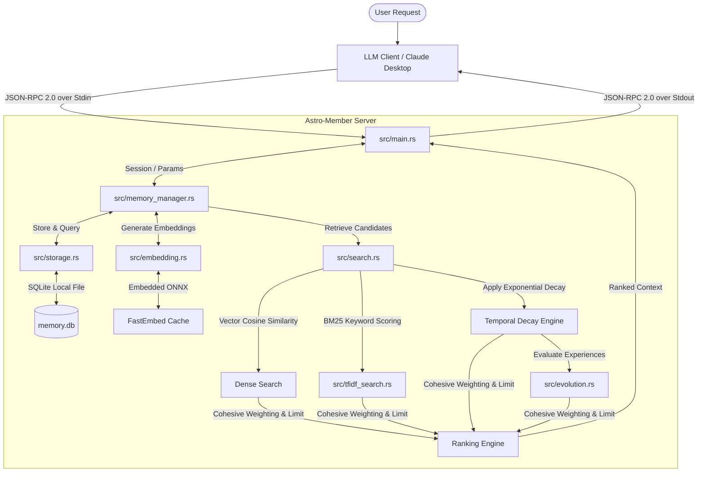

# Astro-Member: 技术架构与工具接口开发手册

本文件提供了关于 `astro-member` 架构设计、记忆分层模型、混合搜索引擎、工具接口规范以及环境配置的详细技术说明。

---

## 🗺️ 系统架构

`astro-member` 作为 Model Context Protocol (MCP) 服务端运行，通过标准输入输出（stdin/stdout）基于 JSON-RPC 2.0 协议与客户端（如 Claude Desktop）进行数据交互。



---

## 🧠 多层级记忆分层模型

`astro-member` 中的记忆被划分为四个逻辑层级，每一层在检索权重和时间衰减策略上都有所不同：

### 1. 规则层 (Rule Layer - 基础权重: `2.0`)
- **定位**：永久性的智能体指令、系统 Prompt 准则以及严格的编译/操作限制。
- **衰减机制**：免受时间衰减影响（时间衰减系数恒为 `1.0`）。
- **过滤机制**：检索时免受最低相似度门槛（`0.65`）的过滤限制，只要与检索词存在微弱相关，就会被召回，确保核心指令不丢失。

### 2. 人设层 (Persona Layer - 基础权重: `1.5`)
- **定位**：定义智能体或用户的身份背景、语气倾向、角色性格特征及风格设定。
- **衰减机制**：衰减速度极其缓慢（指数衰减系数为 $e^{-0.001t}$），确保人设随时间不易发生漂移，但允许极长期限内的微调。
- **过滤机制**：检索时同样免受最低相似度门槛（`0.65`）的过滤限制。

### 3. 经验层 (Experience Layer - 基础权重: `1.0`)
- **定位**：存储过往问题场景、系统设计、调试路径及代码实现的最优解。
- **动态强化学习**：
  - 每一条经验项在入库时默认评分为 `1.0`。
  - 当调用 `evaluate_experience` 且反馈 `success=true` 时，该记忆的评分将乘以 `1.1`（上限封顶 `5.0`）。
  - 当反馈 `success=false` 时，该评分乘以 `0.8`（下限限制为 `0.1`）。
  - 检索时的综合评分计算公式为：$\text{基础权重} \times \text{相似度分数} \times \text{经验评分}$。

### 4. 会话层 (Session Layer - 基础权重: `1.0`)
- **定位**：存储当前活跃会话的短期上下文及交互细节。
- **物理与逻辑隔离**：严格通过 `session_id` 进行隔离。检索或读取时如未提供匹配的 `session_id`，则完全无法查看或篡改相关条目。
- **衰减机制**：衰减极其迅速（指数衰减系数为 $e^{-0.2t}$），模仿人类短时记忆遗忘规律，避免大模型上下文窗口迅速过载。

---

## 🛠️ MCP 工具接口详细手册

本服务端向客户端暴露 6 个 JSON-RPC 工具。以下为详细的参数规范、可选行为说明和 JSON-RPC 载荷示例。

### 1. `store_memory`
将一条记忆概念化存储到特定的内存层级中。

#### 参数详细说明
| 参数名称 | 类型 | 是否必填 | 约束与默认值 | 作用与行为说明 |
| :--- | :--- | :--- | :--- | :--- |
| `layer` | String | **是** | 枚举值：`["Rule", "Persona", "Experience", "Session"]` (向前兼容 `"Principle"` 别名，将其解析为 `"Rule"`) | 目标存储的层级。 |
| `content` | String | **是** | 非空字符串 | 待存储记忆的文本具体内容。 |
| `session_id` | String | **条件必填** | 如果 `layer` 为 `"Session"`，则此参数必填；否则必须为空或不传。 | 会话唯一标识符，用于隔离短期记忆。 |
| `context_tags` | Array of Strings | 否 | 默认值：`[]` | 分类元数据标签，便于后续按分类检索。 |

#### 可选参数与条件限制行为
- **`session_id`**：
  - **会话层约束**：当且仅当 `layer` 为 `"Session"` 时，调用者必须提供非空 `session_id`。如果省略，服务端将返回校验错误。
  - **全局层约束**：如果 `layer` 为其他全局层级（`Rule`、`Persona`、`Experience`），则**绝对不可**传入 `session_id`。若传入非空值，服务端将拒绝写入，以保持全局记忆数据的通用性。
- **`context_tags`**：
  - 此为可选数组，标签以 JSON 形式保存在数据库中，供开发者侧进行手动辅助过滤。

#### JSON-RPC 2.0 示例
**请求（会话层记忆写入）**：
```json
{
  "jsonrpc": "2.0",
  "method": "tools/call",
  "params": {
    "name": "store_memory",
    "arguments": {
      "layer": "Session",
      "session_id": "session-1234",
      "content": "用户偏好在 Windows 环境下使用 PowerShell 编译，而非 cmd。",
      "context_tags": ["preference", "windows"]
    }
  },
  "id": 1
}
```
**响应**：
```json
{
  "jsonrpc": "2.0",
  "result": {
    "content": [
      {
        "type": "text",
        "text": "{\"status\":\"success\",\"memory_id\":\"fa189c6f-a89e-4e89-a20d-85f26588db22\"}"
      }
    ]
  },
  "id": 1
}
```

---

### 2. `retrieve_memory`
在所有适用层级中进行双轨（向量余弦相似度 + BM25 关键词匹配）加权检索。

#### 参数详细说明
| 参数名称 | 类型 | 是否必填 | 约束与默认值 | 作用与行为说明 |
| :--- | :--- | :--- | :--- | :--- |
| `query` | String | **是** | 非空字符串 | 检索关键词或语句。 |
| `session_id` | String | 否 | 默认值：`null` | 当前活跃会话 ID。如提供，则检索时将包含此会话下的 Session 层记忆。 |

#### 可选参数检索行为
- **`session_id`**：
  - **传入时**：搜索引擎将扫描全局共享层级（Rule、Persona、Experience），并合并检索符合该 `session_id` 的会话层记忆。
  - **未传入时**：检索范围仅限全局共享层级，完全屏蔽和过滤 Session 层的任何记忆。这能杜绝在无会话上下文或跨会话请求中泄露其它会话的敏感短期记忆。
- **相似度噪声过滤阈值**：
  - 本系统对 `Experience`（经验）与 `Session`（会话）层记忆设置了 **`0.65`** 的严格语义余弦相似度下限。低于此相关性的内容会被直接过滤，防止噪声污染上下文。
  - `Rule`（规则）与 `Persona`（人设）层**豁免**该门槛值，确保核心规则即使在匹配度较低时也能正常呈递给 LLM。

#### JSON-RPC 2.0 示例
**请求**：
```json
{
  "jsonrpc": "2.0",
  "method": "tools/call",
  "params": {
    "name": "retrieve_memory",
    "arguments": {
      "query": "PowerShell 编译环境偏好",
      "session_id": "session-1234"
    }
  },
  "id": 2
}
```
**响应**：
```json
{
  "jsonrpc": "2.0",
  "result": {
    "content": [
      {
        "type": "text",
        "text": "{\"results\":[{\"memory\":{\"id\":\"fa189c6f-a89e-4e89-a20d-85f26588db22\",\"layer\":\"Session\",\"session_id\":\"session-1234\",\"content\":\"用户偏好在 Windows 环境下使用 PowerShell 编译，而非 cmd。\",\"tags\":[\"preference\",\"windows\"],\"created_at\":\"2026-06-06T06:26:00Z\",\"last_accessed\":\"2026-06-06T06:27:00Z\",\"access_count\":1,\"evaluation_score\":1.0},\"score\":1.85}]}"
      }
    ]
  },
  "id": 2
}
```

---

### 3. `get_memory_by_id`
通过唯一 UUID 检索特定记忆。

#### 参数详细说明
| 参数名称 | 类型 | 是否必填 | 约束与默认值 | 作用与行为说明 |
| :--- | :--- | :--- | :--- | :--- |
| `id` | String | **是** | UUID 格式字符串 | 目标记忆条目的唯一标识符。 |
| `session_id` | String | **条件必填** | 若目标记忆条目属于 Session 层，则此参数必填；否则可不传。 | 用于验证 Session 层记忆访问权限的安全校验参数。 |

#### 可选参数安全校验行为
- **`session_id`**：
  - 如果待获取的记忆记录属于 `"Session"` 层，则传入的 `session_id` **必须**与数据库中存储的该条记忆的 `session_id` 完全一致。如果值不匹配或者调用时未提供该参数，服务端将直接返回 NotFound 错误。
  - 该机制有效阻断了黑客或越权智能体通过穷举 UUID 来窃取其它隔离会话数据的安全风险。

#### JSON-RPC 2.0 示例
**请求**：
```json
{
  "jsonrpc": "2.0",
  "method": "tools/call",
  "params": {
    "name": "get_memory_by_id",
    "arguments": {
      "id": "fa189c6f-a89e-4e89-a20d-85f26588db22",
      "session_id": "session-1234"
    }
  },
  "id": 3
}
```
**响应**：
```json
{
  "jsonrpc": "2.0",
  "result": {
    "content": [
      {
        "type": "text",
        "text": "{\"status\":\"success\",\"memory\":{\"id\":\"fa189c6f-a89e-4e89-a20d-85f26588db22\",\"layer\":\"Session\",\"session_id\":\"session-1234\",\"content\":\"用户偏好在 Windows 环境下使用 PowerShell 编译，而非 cmd。\",\"tags\":[\"preference\",\"windows\"],\"created_at\":\"2026-06-06T06:26:00Z\",\"last_accessed\":\"2026-06-06T06:27:00Z\",\"access_count\":2,\"evaluation_score\":1.0}}"
      }
    ]
  },
  "id": 3
}
```

---

### 4. `evaluate_experience`
对经验层记忆进行成功或失败反馈，以此实现基于强化反馈的检索动态加权。

#### 参数详细说明
| 参数名称 | 类型 | 是否必填 | 约束与默认值 | 作用与行为说明 |
| :--- | :--- | :--- | :--- | :--- |
| `memory_id` | String | **是** | 经验层记忆的 UUID | 需要进行反馈调节的经验层记忆 ID。 |
| `success` | Boolean | **是** | `true` 或 `false` | 运行反馈结果。`true` 代表运行成功，`false` 代表运行失败。 |

#### 反馈修改行为与层级校验
- **层级保护**：此操作**仅**适用于 `"Experience"`（经验层）记忆。如果尝试对 Rule、Persona 或 Session 层的记忆调用该接口，服务端将直接拦截并返回 `"Memory is not in the Experience layer"` 错误。
- **权重修正系数**：
  - `success=true`：当前评估分数（`evaluation_score`）乘以 **`1.1`**（最大限制封顶值为 `5.0`）。
  - `success=false`：当前评估分数乘以 **`0.8`**（最小限制保底值为 `0.1`）。

#### JSON-RPC 2.0 示例
**请求**：
```json
{
  "jsonrpc": "2.0",
  "method": "tools/call",
  "params": {
    "name": "evaluate_experience",
    "arguments": {
      "memory_id": "7ca83c6f-a89e-4e89-a20d-85f26588db99",
      "success": true
    }
  },
  "id": 4
}
```
**响应**：
```json
{
  "jsonrpc": "2.0",
  "result": {
    "content": [
      {
        "type": "text",
        "text": "{\"status\":\"evaluated\"}"
      }
    ]
  },
  "id": 4
}
```

---

### 5. `create_association`
在两条记忆之间建立有向的图关联关系。

#### 参数详细说明
| 参数名称 | 类型 | 是否必填 | 约束与默认值 | 作用与行为说明 |
| :--- | :--- | :--- | :--- | :--- |
| `source_id` | String | **是** | UUID 格式字符串 | 关联关系的起点记忆 UUID。在数据库中必须真实存在。 |
| `target_id` | String | **是** | UUID 格式字符串 | 关联关系的终点记忆 UUID。在数据库中必须真实存在。 |
| `relation_type` | String | **是** | 自定义字符串 (如 `"depends_on"`, `"contradicts"`) | 用以表达起点到终点之间语义逻辑的关联类型词。 |

#### 约束与数据完整性
- **防止自环**：`source_id` 与 `target_id` 不能相同。服务端在数据库外键和逻辑上禁止创建指向自身的语义环。
- **外键约束**：源记忆与目标记忆必须在数据库中真实存在，否则抛出外键完整性约束错误。
- **级联删除**：当某条记忆被删除时，在 `associations` 表中以该记忆 ID 作为 `source_id` 或 `target_id` 的所有图关联边都会被 SQLite 数据库自动级联删除，防止产生孤立的有向边。

#### JSON-RPC 2.0 示例
**请求**：
```json
{
  "jsonrpc": "2.0",
  "method": "tools/call",
  "params": {
    "name": "create_association",
    "arguments": {
      "source_id": "fa189c6f-a89e-4e89-a20d-85f26588db22",
      "target_id": "7ca83c6f-a89e-4e89-a20d-85f26588db99",
      "relation_type": "depends_on"
    }
  },
  "id": 5
}
```
**响应**：
```json
{
  "jsonrpc": "2.0",
  "result": {
    "content": [
      {
        "type": "text",
        "text": "{\"status\":\"association_created\"}"
      }
    ]
  },
  "id": 5
}
```

---

### 6. `get_associations`
获取与特定记忆节点相连的有向关联关系列表。

#### 参数详细说明
| 参数名称 | 类型 | 是否必填 | 约束与默认值 | 作用与行为说明 |
| :--- | :--- | :--- | :--- | :--- |
| `source_id` | String | **是** | UUID 格式字符串 | 查询中心节点的记忆 UUID。 |
| `direction` | String | 否 | 枚举值：`["outgoing", "incoming", "both"]` (默认值为 `"outgoing"`) | 以源记忆为起点的检索关系方向。 |

#### 可选参数查询行为说明
- **`direction`**：
  - `"outgoing"` (默认)：仅查询以 `source_id` 作为起点的出边。即当前记忆引用或依赖了哪些其它记忆。
  - `"incoming"`：仅查询以 `source_id` 作为终点的入边。即当前记忆被哪些其它记忆所依赖或引用。
  - `"both"`：合并查询入边和出边，完整勾勒当前节点在记忆图网络中的邻接节点。

#### JSON-RPC 2.0 示例
**请求**：
```json
{
  "jsonrpc": "2.0",
  "method": "tools/call",
  "params": {
    "name": "get_associations",
    "arguments": {
      "source_id": "fa189c6f-a89e-4e89-a20d-85f26588db22",
      "direction": "both"
    }
  },
  "id": 6
}
```
**响应**：
```json
{
  "jsonrpc": "2.0",
  "result": {
    "content": [
      {
        "type": "text",
        "text": "{\"associations\":[{\"source_id\":\"fa189c6f-a89e-4e89-a20d-85f26588db22\",\"target_id\":\"7ca83c6f-a89e-4e89-a20d-85f26588db99\",\"relation_type\":\"depends_on\"}]}"
      }
    ]
  },
  "id": 6
}
```

---

## ⚙️ 环境配置与物理存储规范

### 1. `FASTEMBED_CACHE_PATH` 环境变量
指定 FastEmbed 在运行时下载、缓存与加载嵌入模型权重（如 ONNX 格式模型和词词器分词器）的存储路径：
- **未配置（默认行为）**：模型将下载并存放在运行数据库同级目录下的 `models_cache` 目录中。例如，若使用默认数据库目录，则模型缓存保存在 `.mcp_memory_storage/models_cache` 下。
- **设置为特定目录**（如 `FASTEMBED_CACHE_PATH=D:\cache\fastembed`）：服务器将统一从此绝对/相对路径下加载模型。
- **设置为特殊字符串 `"None"`**：系统会跳过本地路径覆盖，回退使用 FastEmbed 官方底层定义的全局系统默认缓存目录（例如 Windows 上的 `%USERPROFILE%\AppData\Local`，或者 Linux 上的 `~/.local/share`）。

### 2. 数据库物理存储目录
在未进行特殊配置时，程序将在其被调用启动时的当前工作目录下（CWD）默认创建 `.mcp_memory_storage` 文件夹：
- `memory.db`：SQLite3 关系型有状态数据库文件，用于持久化存储离散记忆、会话、上下文元数据标签评分以及关系关联图。
- `models_cache/`：模型权重文件目录（若未配置 `FASTEMBED_CACHE_PATH` 自定义路径）。

---

## 🧪 测试与验证规范

### 1. 单元测试与集成测试
代码中的单元测试覆盖了 SQLite 本地存储事务完整性、TF-IDF BM25 词频计算匹配细节、时间指数衰减保底机制以及 UUID 校验等逻辑：
```bash
cargo test
```

### 2. 自动化端到端 (E2E) 测试
项目自带的 `test_e2e.py` 端到端测试脚本基于 Python 编写，通过拉起编译出的程序并劫持标准输入输出，验证了全部 90+ 项场景下的 JSON-RPC 规范响应：
```bash
# 1. 编译 Debug 版本的可执行文件
cargo build
# 2. 运行集成测试验证工具完整性
pytest test_e2e.py -v
```
该 E2E 脚本会隔离临时测试目录、按流读写标准 I/O，并严密断言每一个工具参数异常分支与越权访问边界。
